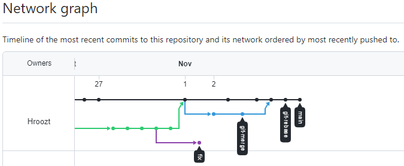

В результате выполнения были небольшие отступления от пунктов задания.
Был реализован конфликт при merge а не при rebase.
в итоге конфлик был решен при мердже в результате чего ребейз произошел без ошибок.
Можно смоделировать обратную ситуацию, если такой результат не принимается.

Лог коммитов

c1813bf git-rebase 1
3897a83 fix merge conflict
862f2a6 main branch change rebase
734288c merge: use shift
5a0392f prepare for merge and rebase
d46463d merge: @ instead *
21056a5 REsolved merge conflict
6e7714a Moved and deleted
ae60787 Prepare to delete and move
4cfe340 Edit README.md \ gitignore description
2c3e9aa Added gitignore
d0b8b6f First commit
e01fec6 second commit
86ce63f first commit
4f588a4 Initial commit

Граф 

* commit c1813bf6cfffa046a3499350edc84fc182506fd3
| Author: Aitov <hroozt@mail.ru>
| Date:   Tue Nov 2 23:14:51 2021 +0700
| 
|     git-rebase 1
|   
*   commit 3897a832fcced89874919a25e64e64cb6102f17d
|\  Merge: 862f2a6 734288c
| | Author: Aitov <hroozt@mail.ru>
| | Date:   Tue Nov 2 23:34:42 2021 +0700
| | 
| |     fix merge conflict
| | 
| * commit 734288c18d96f95487819c5ee5576918bb2bbc35
| | Author: Aitov <hroozt@mail.ru>
| | Date:   Tue Nov 2 23:05:32 2021 +0700
| | 
| |     merge: use shift
| | 
| * commit d46463dc4fdc59426afb93b7cb57cac873af4b80
| | Author: Aitov <hroozt@mail.ru>
| | Date:   Tue Nov 2 22:47:27 2021 +0700
| | 
| |     merge: @ instead *
| | 
* | commit 862f2a65e3e832984b9a8b71dbd12b7e2907cb44
| | Author: Aitov <hroozt@mail.ru>
| | Date:   Tue Nov 2 23:08:35 2021 +0700
| | 
| |     main branch change rebase
| | 
* | commit 5a0392f0a91233076760153bbfef71c23b2c2707
|/  Author: Aitov <hroozt@mail.ru>
|   Date:   Tue Nov 2 22:53:58 2021 +0700
|   
|       prepare for merge and rebase
|   
*   commit 21056a5a8e978ca6478f866213e2ed7a89131bba
|\  Merge: e01fec6 6e7714a
| | Author: Aitov <hroozt@mail.ru>
| | Date:   Mon Nov 1 13:01:39 2021 +0700
| | 
| |     REsolved merge conflict
| | 
| * commit 6e7714ad3a4b697195a9b859446aa5a2135d69cc
| | Author: Aitov Alexey <hroozt@mail.ru>
| | Date:   Wed Oct 27 23:23:27 2021 +0700
| | 
| |     Moved and deleted
| | 
| * commit ae6078759943c990866786ecbd040f48eafcead0
| | Author: Aitov Alexey <hroozt@mail.ru>
| | Date:   Wed Oct 27 23:17:45 2021 +0700
| | 
| |     Prepare to delete and move
| | 
| * commit 4cfe340681e3945f9e71cdf0bb3778f80e9c3461
| | Author: Aitov Alexey <hroozt@mail.ru>
| | Date:   Wed Oct 27 23:14:37 2021 +0700
| | 
| |     Edit README.md \ gitignore description
| | 
| * commit 2c3e9aa800db8bc8c6b10802a2f576f6ec25f0fb
| | Author: Aitov Alexey <hroozt@mail.ru>
| | Date:   Wed Oct 27 22:57:20 2021 +0700
| | 
| |     Added gitignore
| | 
| * commit d0b8b6f469b5b3d13eac197584f31be7d43612c3
| | Author: Aitov Alexey <hroozt@mail.ru>
| | Date:   Wed Oct 27 22:42:18 2021 +0700
| | 
| |     First commit
| | 
* | commit e01fec6674a4801b0bb23bb45fd118e5795fb4e2
| | Author: Aitov <hroozt@mail.ru>
| | Date:   Wed Oct 27 10:30:44 2021 +0700
| | 
| |     second commit
| | 
* | commit 86ce63f852c22f34afeea399fbdba0f5962699f2
|/  Author: Aitov <hroozt@mail.ru>
|   Date:   Tue Oct 26 21:27:01 2021 +0700
|   
|       first commit
| 
* commit 4f588a49b9f852ce9137c4ffe5fc9f6847a25427
  Author: Hroozt <92970717+Hroozt@users.noreply.github.com>
  Date:   Tue Oct 26 20:59:19 2021 +0700
  
      Initial commit

