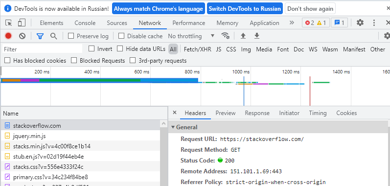

# Домашнее задание к занятию "3.9. Элементы безопасности информационных систем"

1. Установите Bitwarden плагин для браузера. Зарегестрируйтесь и сохраните несколько паролей.
> Сделано

2. Установите Google authenticator на мобильный телефон. Настройте вход в Bitwarden акаунт через Google authenticator OTP.


3. Установите apache2, сгенерируйте самоподписанный сертификат, настройте тестовый сайт для работы по HTTPS.

>apache2 был установлен
>Сертификат сгенерирован
>```commandline
>root@vagrant:/var/www/html# openssl req -x509 -nodes -days 365 -newkey rsa:2048 -keyout /etc/ssl/private/apache-selfsigned.key -out /etc/ssl/certs/apa che-selfsigned.crt
>Generating a RSA private key
>......................+++++
>```
>Сайт работает: https://hroozt.xyz
>


4. Проверьте на TLS уязвимости произвольный сайт в интернете (кроме сайтов МВД, ФСБ, МинОбр, НацБанк, РосКосмос, РосАтом, РосНАНО и любых госкомпаний, объектов КИИ, ВПК ... и тому подобное).
>https://hroozt.xyz/ssltest.html
>проверка при помощи testssl.sh
>


5. Установите на Ubuntu ssh сервер, сгенерируйте новый приватный ключ. Скопируйте свой публичный ключ на другой сервер. Подключитесь к серверу по SSH-ключу.
 
 ```comandline
 Generating public/private rsa key pair.
Enter file in which to save the key (/root/.ssh/id_rsa): /home/vagrant/.ssh/id_rsa
Enter passphrase (empty for no passphrase):
Enter same passphrase again:
Your identification has been saved in /home/vagrant/.ssh/id_rsa
Your public key has been saved in /home/vagrant/.ssh/id_rsa.pub
The key fingerprint is:
SHA256:8BO+g269RJHL4oQYD+ddCgHZRmvy2Hv4KJCG8yPfhE4 root@vagrant
The key's randomart image is:
+---[RSA 3072]----+
|  .=o            |
|  . oo   .       |
|  +.= . =        |
|   & + B +       |
|..o * = S        |
|=. . = + o       |
|.+E + +.+        |
|.o+o =....       |
| oooo.o ..       |
+----[SHA256]-----+
```
```comandline
vagrant@vagrant:~$ sudo ssh-copy-id -i /root/.ssh/id_rsa.pub glos@earth.gk-sky.com                                                                                                           /usr/bin/ssh-copy-id: INFO: Source of key(s) to be installed: "/root/.ssh/id_rsa.pub"
/usr/bin/ssh-copy-id: INFO: attempting to log in with the new key(s), to filter out any that are already installed
/usr/bin/ssh-copy-id: INFO: 1 key(s) remain to be installed -- if you are prompted now it is to install the new keys
glos@earth.gk-sky.com's password:
Permission denied, please try again.
glos@earth.gk-sky.com's password:

Number of key(s) added: 1

Now try logging into the machine, with:   "ssh 'glos@earth.gk-sky.com'"
and check to make sure that only the key(s) you wanted were added.

```
```comandline
root@vagrant:/home/vagrant# ssh 'glos@earth.gk-sky.com'
Welcome to Ubuntu 12.04.4 LTS (GNU/Linux 3.5.0-23-generic i686)

```
6. Переименуйте файлы ключей из задания 5. Настройте файл конфигурации SSH клиента, так чтобы вход на удаленный сервер осуществлялся по имени сервера.
>ключь переименован /root/.ssh/id_rsa_new
>файл конфига лежит в /root/.ssh/config
```comandline
Host earth
HostName earth.gk-sky.com
IdentityFile /root/.ssh/id_rsa_new
User glos
```
>результат
```comandline
root@vagrant:~/.ssh# ssh earth
Welcome to Ubuntu 12.04.4 LTS (GNU/Linux 3.5.0-23-generic i686)
```

7. Соберите дамп трафика утилитой tcpdump в формате pcap, 100 пакетов. Откройте файл pcap в Wireshark.
```commandline
root@vagrant:/tmp# tcpdump -c 100 -w dump.pcap
tcpdump: listening on eth0, link-type EN10MB (Ethernet), capture size 262144 bytes
100 packets captured
309 packets received by filter
0 packets dropped by kernel

```

