# Домашнее задание к занятию "3.5. Файловые системы"

1. Узнайте о [sparse](https://ru.wikipedia.org/wiki/%D0%A0%D0%B0%D0%B7%D1%80%D0%B5%D0%B6%D1%91%D0%BD%D0%BD%D1%8B%D0%B9_%D1%84%D0%B0%D0%B9%D0%BB) (разряженных) файлах.
   **Узали**

2. Могут ли файлы, являющиеся жесткой ссылкой на один объект, иметь разные права доступа и владельца? Почему?
    **- Нет. Хардлинки ссылаются на один и тот же "Файл"**

3. Сделайте `vagrant destroy` на имеющийся инстанс Ubuntu. Замените содержимое Vagrantfile следующим:

    ```bash
    Vagrant.configure("2") do |config|
      config.vm.box = "bento/ubuntu-20.04"
      config.vm.provider :virtualbox do |vb|
        lvm_experiments_disk0_path = "/tmp/lvm_experiments_disk0.vmdk"
        lvm_experiments_disk1_path = "/tmp/lvm_experiments_disk1.vmdk"
        vb.customize ['createmedium', '--filename', lvm_experiments_disk0_path, '--size', 2560]
        vb.customize ['createmedium', '--filename', lvm_experiments_disk1_path, '--size', 2560]
        vb.customize ['storageattach', :id, '--storagectl', 'SATA Controller', '--port', 1, '--device', 0, '--type', 'hdd', '--medium', lvm_experiments_disk0_path]
        vb.customize ['storageattach', :id, '--storagectl', 'SATA Controller', '--port', 2, '--device', 0, '--type', 'hdd', '--medium', lvm_experiments_disk1_path]
      end
    end
    ```

    Данная конфигурация создаст новую виртуальную машину с двумя дополнительными неразмеченными дисками по 2.5 Гб.
       **Сделано**

4. Используя `fdisk`, разбейте первый диск на 2 раздела: 2 Гб, оставшееся пространство.
   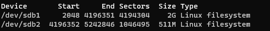

5. Используя `sfdisk`, перенесите данную таблицу разделов на второй диск.
    
   ```root@vagrant:/home/vagrant# sfdisk -d /dev/sdb | sfdisk /dev/sdc```

6. Соберите `mdadm` RAID1 на паре разделов 2 Гб.
    
    ```root@vagrant:/home/vagrant# mdadm --create /dev/md0 --level=1 --raid-devices=2 /dev/sdb1 /dev/sdc1```
   
7. Соберите `mdadm` RAID0 на второй паре маленьких разделов.
    
    ```root@vagrant:/home/vagrant# mdadm --create /dev/md1 --level=0 --raid-devices=2 /dev/sdb2 /dev/sdc2```
    
8. Создайте 2 независимых PV на получившихся md-устройствах.
    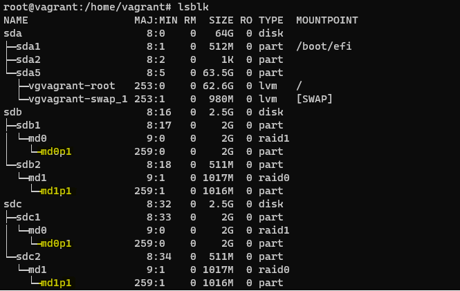
    
9. Создайте общую volume-group на этих двух PV.
    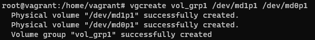
    
10. Создайте LV размером 100 Мб, указав его расположение на PV с RAID0.
    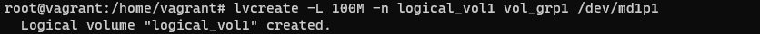
    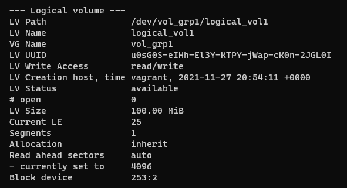

11. Создайте `mkfs.ext4` ФС на получившемся LV.
    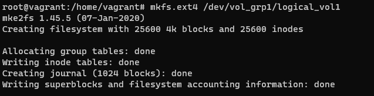

12. Смонтируйте этот раздел в любую директорию, например, `/tmp/new`.
    
    ```root@vagrant:/home/vagrant# mount /dev/vol_grp1/logical_vol1 /tmp/new```
       
13. Поместите туда тестовый файл, например `wget https://mirror.yandex.ru/ubuntu/ls-lR.gz -O /tmp/new/test.gz`.
    
    **Сделано**   

14. Прикрепите вывод `lsblk`.
     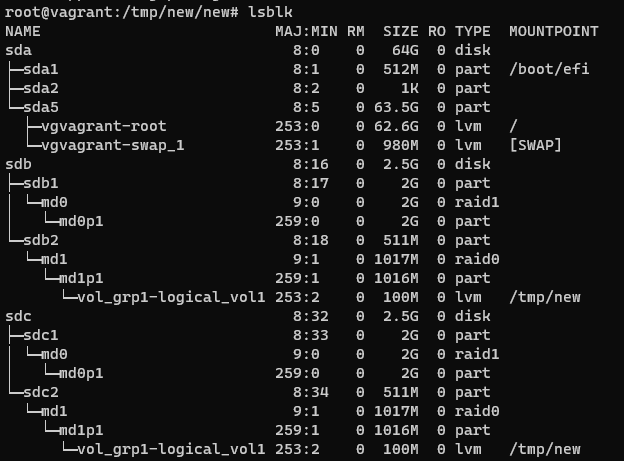

15. Протестируйте целостность файла:

     ```bash
     root@vagrant:~# gzip -t /tmp/new/test.gz
     root@vagrant:~# echo $?
     0
     ```

16. Используя pvmove, переместите содержимое PV с RAID0 на RAID1.
    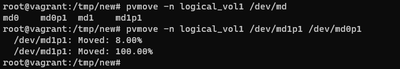
    
17. Сделайте `--fail` на устройство в вашем RAID1 md.
    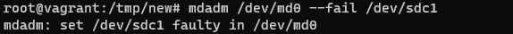
    
18. Подтвердите выводом `dmesg`, что RAID1 работает в деградированном состоянии.

    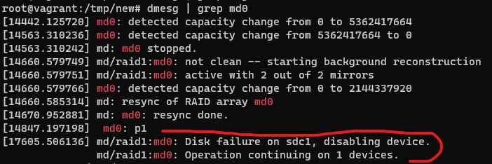

19. Протестируйте целостность файла, несмотря на "сбойный" диск он должен продолжать быть доступен:

     ```bash
     root@vagrant:~# gzip -t /tmp/new/test.gz
     root@vagrant:~# echo $?
     0
     ```
    ```Успешно```
    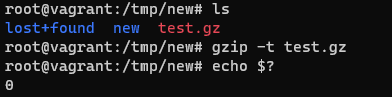

20. Погасите тестовый хост, `vagrant destroy`.