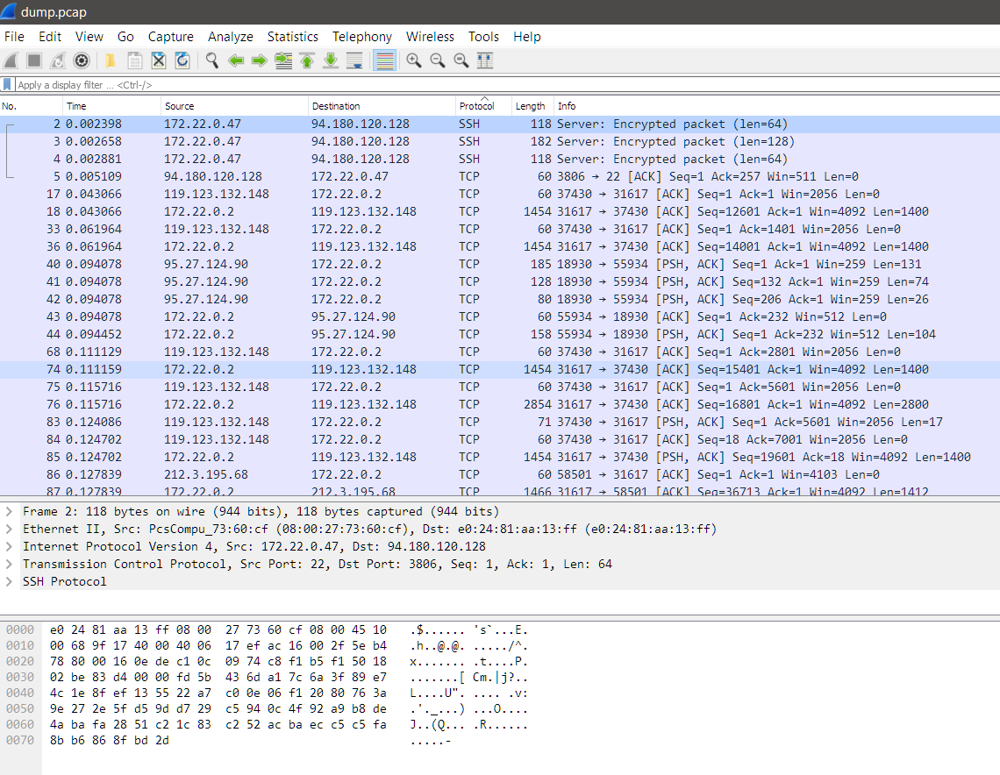

# Домашнее задание к занятию "3.6. Компьютерные сети, лекция 1"

###1. Работа c HTTP через телнет.
- Подключитесь утилитой телнет к сайту stackoverflow.com
`telnet stackoverflow.com 80`
- отправьте HTTP запрос
```bash
GET /questions HTTP/1.0
HOST: stackoverflow.com
[press enter]
[press enter]
```
В ответе укажите полученный HTTP код, что он означает?

>```commandline
>vagrant@vagrant:~$ telnet stackoverflow.com 80
>Trying 151.101.129.69...
>Connected to stackoverflow.com.
>Escape character is '^]'.
>GET /questions HTTP/1.0
>HOST: stackoverflow.com
>
>HTTP/1.1 301 Moved Permanently
>```
>Код 301 - постоянный редирект. на location: https://stackoverflow.com/questions

###2.Повторите задание 1 в браузере, используя консоль разработчика F12.
- откройте вкладку `Network`
- отправьте запрос http://stackoverflow.com
- найдите первый ответ HTTP сервера, откройте вкладку `Headers`
- укажите в ответе полученный HTTP код.
- проверьте время загрузки страницы, какой запрос обрабатывался дольше всего?
- приложите скриншот консоли браузера в ответ.

>Первый запрос обрабатывался дольше всего за счет времени ожидания TTFB (Ожидание первого бита)
>

###3. Какой IP адрес у вас в интернете?

>5.129.86.19

###4. Какому провайдеру принадлежит ваш IP адрес? Какой автономной системе AS? Воспользуйтесь утилитой `whois`

>```commandline
>% Information related to '5.129.0.0/17AS31200'
>
>route:          5.129.0.0/17
>descr:          Novotelecom Ltd. <-------- my ISP
>origin:         AS31200  <------- my AS
>mnt-by:         RU-NTK-MNT
>created:        2015-05-25T06:22:16Z
>last-modified:  2015-05-25T06:22:16Z
>source:         RIPE``
 

###5. Через какие сети проходит пакет, отправленный с вашего компьютера на адрес 8.8.8.8? Через какие AS? Воспользуйтесь утилитой `traceroute`

>утилита трейсроут не отрабатывает корректно без явного указания использовать ICMP, причина не найдена!
> 
>

###6. Повторите задание 5 в утилите `mtr`. На каком участке наибольшая задержка - delay?

>

###7. Какие DNS сервера отвечают за доменное имя dns.google? Какие A записи? воспользуйтесь утилитой `dig`

>```commandline
>;; ANSWER SECTION:
>dns.google.             802     IN      A       8.8.8.8
>dns.google.             802     IN      A       8.8.4.4
>```
###8. Проверьте PTR записи для IP адресов из задания 7. Какое доменное имя привязано к IP? воспользуйтесь утилитой `dig`

>```
>vagrant@vagrant:~$ dig -x 8.8.8.8
>
>...
>
>;; ANSWER SECTION:
>8.8.8.8.in-addr.arpa.   5717    IN      PTR     dns.google.
>```
>```commandline
>vagrant@vagrant:~$ dig -x 8.8.4.4
>
>...
>
>;; ANSWER SECTION:
>4.4.8.8.in-addr.arpa.   80881   IN      PTR     dns.google.
