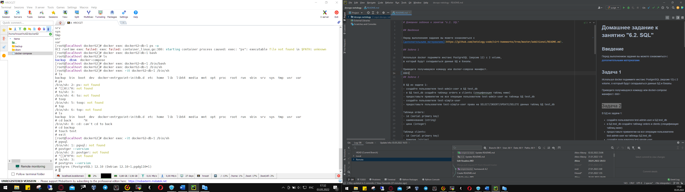

# Домашнее задание к занятию "3.1. Работа в терминале, лекция 1"

1. Выполнено. Oracle VirtualBox установлен.

2. Выполнено. Hashicorp Vagrant установлен.

3. Используется Windows Terminal в Windows - Выполнено.

4. Выполнено. Ubuntu 20.04 установлена и запущена со снапшота Vagrant.

5. Выполнено. Стандартная кофигурация убунту из снапшота:
   

6. Изменен конфиг файл:

`    
    Vagrant.configure("2") do |config|
        сonfig.vm.box = "bento/ubuntu-20.04"
        config.vm.provider "virtualbox" do |v|
            v.memory = 2024
            v.cpus = 4
            v.name = "netology_devops"
        end
    end 
`

   

8.  `vagrant ssh` Практика в консоли проведена.

9. Ознакомиться с разделами `man bash`:
    * длину журнала `history' можно изменить переменной histsize (default 500). line 992
    * `ignoreboth` - определяет какие команды будут записаны в History (содержит в себе ignorespace, ignordups)
10. `{}` описание\определение тела функции или список комманд (команда группировки) в текущей среде. 454 строка \ 293 строка
11.   Как создать однократным вызовом `touch` 100000 файлов? - touch file{1..1000}
      Получится ли аналогичным образом создать 300000? - нет, ограничение на длинну строки аргументов (2097152) 
12. Условное выражение, возвращает 1 если /tmp существует и является директорией
13. 
14. at - запуск по времени (заданному) batch - запуск тпри низкой загрузке системы.
15. Завершите работу виртуальной машины чтобы не расходовать ресурсы компьютера и/или батарею ноутбука. - Done =)
Любые вопросы по решению задач задавайте в чате Slack.
